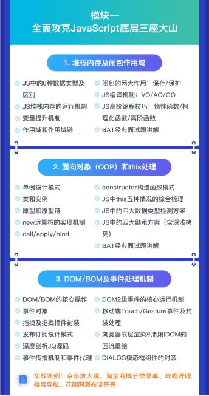
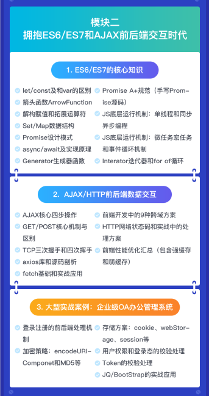
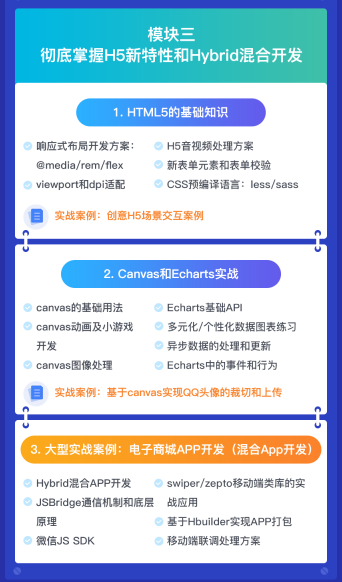
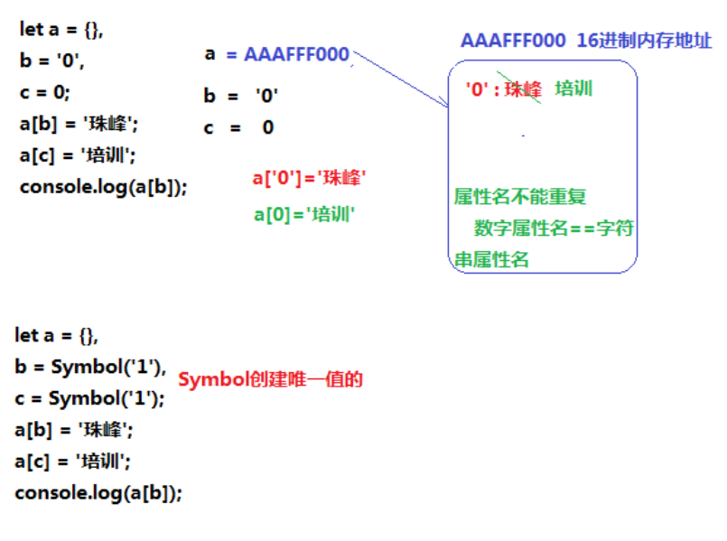
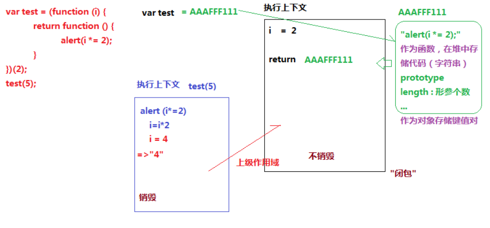

# ZhuFengMianShiXunLianYing
珠峰面试培训

## 第二天

- 模块图








- 堆栈内存

  堆：存储引用类型值的空间

  栈：存储基本类型值和指定代码的环境

  ```js
  //example 1
  let a = {}, b = '0', c = 0;
  a[b] = '珠峰';
  a[c] = '培训';
  console.log(a[b]);
  
  //example 2
  let a = {}, b = Symbol('1'), c = Symbol('1');
  a[b] = '珠峰';
  a[c] = '培训';
  console.log(a[b]);
  
  //example 3
  let a = {}, b = { n: '1' }, c = { m: '2' };
  a[b] = '珠峰';
  a[c] = '培训';
  console.log(a[b]);
  ```
  
  
  > 
  > 1、堆内的属性名是不能重复的，属性名都是字符串（不严谨，是唯一值），所以这里的 `‘0‘和0` 没有区别
  >
  > 2、Symbol创建的唯一值，所以 b 和 c 是不一样的
  >
  > 3、对象与数组的区别：数组只能以数字作为索引，而对象可以使用属性名和数字作为索引
  >
  > ```js
  > let a = {}, b = { n: '1' }, c = { m: '2' };
  > a[b] = '珠峰';
  > dir(a):
  > //Object
  > //[object Object]: "培训"
  > //__proto__: Object
  > 
  > #中间过程:
  > b.toString => [object Object]
  > a[object Object] = '珠峰';
  > c.toString => [object Object]
  > a[object Object] = '培训';
  > console.log(a[b]); => '培训'
  > ```
  >
  > 4、自己实现一个Symbol
  >
  > 5、Object.prototype.toString   /   valueOf
  >
  > 6、编译机制

- `alert & 闭包`

  ```js
  var test = (function (i) {
      return function () {
          alert(i *= 2);
      }
  })(2);
  
  test(5);
  ```

  

  
  > 1、遇见会的题不要慌，这里打答案是 `'4'`（字符串4）
  > 2、因为`alert`输出的内容都会被转为字符串
  >
  > 3、思路图：
  >
  > 4、函数堆里边主要存的是代码  / prototype：原型 / 
  >
  > 5、return 只返回函数的地址  /  test 也指向函数的堆
  >
  > 6、去上级作用域里边找 `i` 找到 i = 2